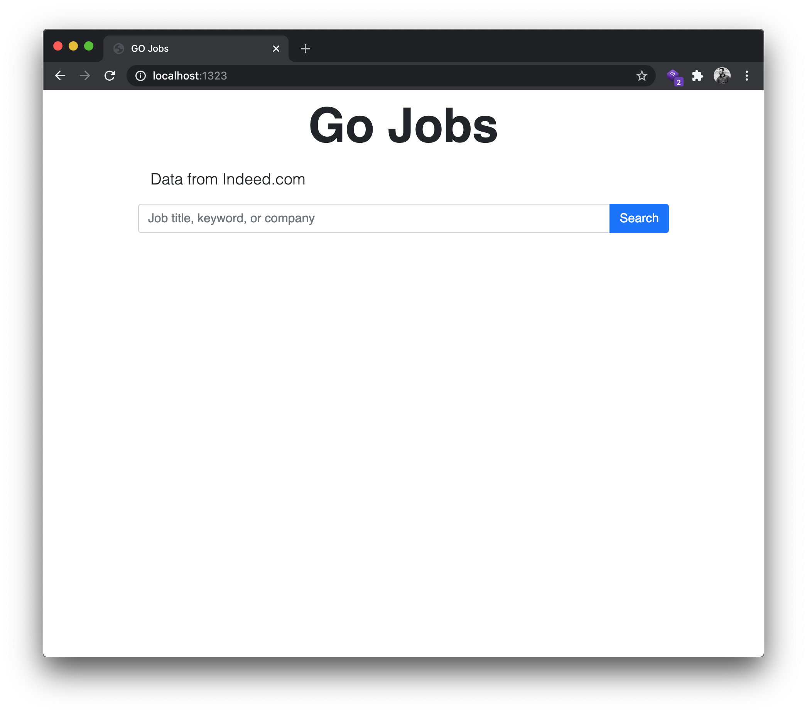

# Go Jobs

A go scrapping project with **goquery** and an **"echo" server** to get data of typed keyword.

Materials:

- bootstrap@5.rc

- [goquery](https://github.com/PuerkitoBio/goquery) library

- and [echo server](https://github.com/labstack/echo) to present on the screen.

  

## Demo

Sneakpeek of the project.




### Get started

- clone the repo.

- navigate to the project directory.
- terminal: 

```go
go run main.go
```

- visit: `localhost:1323`